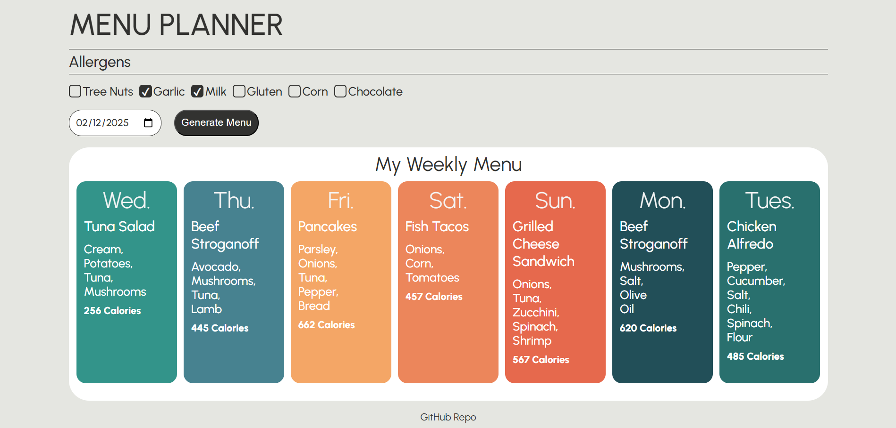

# 📌 Menu Planner

This is a menu scheduling application that allows managers to create weekly menus for staff. The application ensures users have clear visibility of the planned meals while addressing specific dietary restrictions and allergies. This app was designed and built to simplify menu planning and ensure inclusivity for all employees, leveraging JSON-based datasets for dishes and allergy details.

## ✨ Features

- Generates a unique menu for the week
- Ability to pick the start day of the week
- Managers can select allergies to avoid in the menu
- Prevents duplicate dishes from generating in the menu

## Running the project

### 🌐 Live version

- [Link](https://chingumenuplanner.netlify.app/)

### 📂 From the repo

- `git clone https://github.com/chingu-voyages/V53-tier1-team-01.git`
- `cd V53-tier1-team-01.git`
- open `index.html`

## 🛠️ Technologies

- [HTML](https://developer.mozilla.org/en-US/docs/Web/HTML)
- [CSS](https://developer.mozilla.org/en-US/docs/Web/CSS)
- [JS](https://developer.mozilla.org/en-US/docs/Web/JavaScript)

## 🚀 Planed Features

- Enable managers to share the weekly menu with employees via a link.
- Provide the ability to save a menu for future use.

## 👥 Our Team

- Nate : [Github](https://github.com/NatnaelSisay)
- Molly: [GitHub](https://github.com/learningcoding2022) / [LinkedIn](https://www.linkedin.com/in/molly-b-97877492/)
- Valerie: [GitHub](https://github.com/val-ue) / [LinkedIn](https://www.linkedin.com/in/valerielabideveloper/)
- Jessi: [GitHub](https://github.com/jaltrock) / [LinkedIn](https://www.linkedin.com/in/jessi-altrock-developer)
